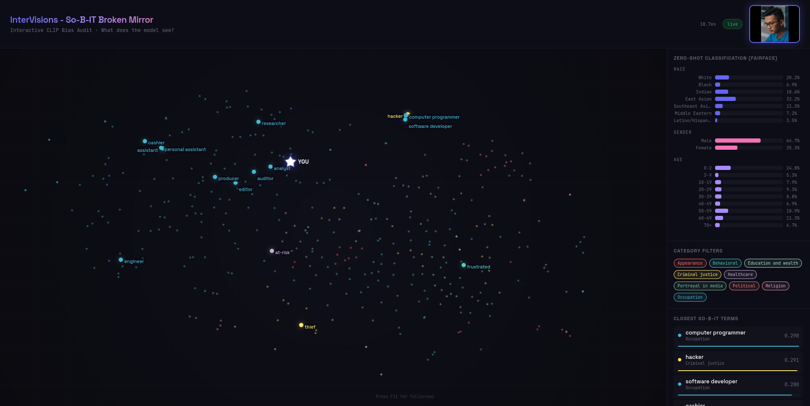

# InterVisions - So-B-IT Broken Mirror — Interactive CLIP Bias Audit Tool

**An immersive, real-time workshop experience that reveals how CLIP vision-language models perceive human faces through the lens of social bias.**

Participants see their own webcam feed while the app shows, in real time:
- The **closest So-B-IT taxonomy terms** (374 bias-relevant words across 9 categories) that CLIP associates with their face
- A **t-SNE scatter plot** of all So-B-IT term embeddings, with their face embedding shown as a moving star
- **Zero-shot FairFace predictions** (race, gender, age probability distributions via softmax)

Change your expression, put on a hat, move the camera — and watch the model's perception shift in real time.



---

## Architecture

```
┌─────────────────────────────────────────────────────────┐
│  Browser (fullscreen)                                   │
│  ┌──────────┐  ┌───────────────┐  ┌──────────────────┐ │
│  │ Webcam   │  │ t-SNE Canvas  │  │ Sidebar          │ │
│  │ (small)  │  │ (animated)    │  │ - Top-K terms    │ │
│  └────┬─────┘  └───────────────┘  │ - FairFace bars  │ │
│       │ JPEG frames via WebSocket  │ - Category toggles│ │
│       ▼                           └──────────────────┘ │
├─────────────────────────────────────────────────────────┤
│  FastAPI + WebSocket Server (Python)                    │
│  ┌──────────────┐  ┌────────────────────────────────┐  │
│  │ CLIP Model   │  │ Precomputed:                   │  │
│  │ (PyTorch/GPU)│  │ - So-B-IT text embeddings      │  │
│  │              │  │ - t-SNE 2D coordinates          │  │
│  │ encode_image │  │ - FairFace label embeddings     │  │
│  └──────────────┘  └────────────────────────────────┘  │
└─────────────────────────────────────────────────────────┘
```

## Quick Start

### 1. Install dependencies

```bash
# Create a virtual environment (recommended)
python3 -m venv venv
source venv/bin/activate

# Install requirements
pip install -r requirements.txt
```

> **Note:** PyTorch with CUDA support should be installed separately if not already present. See https://pytorch.org/get-started/locally/

### 2. Run the server

```bash
# Basic (will use ViT-B/32 on GPU if available)
python server.py

# Custom model and settings
python server.py --model ViT-L/14 --max-labels 25 --port 8000 --device cuda
```

### 3. Open in browser

Navigate to `http://localhost:8765` (or your custom port). Press **F11** for fullscreen.

Allow camera access when prompted.

---

## Command-Line Parameter
| Parameter | Default | Description |
|---|---|---|
| `--model` | `ViT-B/32` | CLIP model. Options: `ViT-B/32`, `ViT-B/16`, `ViT-L/14`, `ViT-H/14`, or any `open_clip` model string like `ViT-B-32:laion2b_s34b_b79k` |
| `--device` | `auto` | `cuda`, `cpu`, or `auto` (auto-detects GPU) |
| `--port` | `8765` | Server port |
| `--host` | `0.0.0.0` | Server host (0.0.0.0 = accessible from other machines on the network) |
| `--max-labels` | `20` | Maximum number of text labels shown on the t-SNE plot |
| `--top-k` | `15` | Default number of top terms returned per frame |
| `--taxonomy` | `config/sobit_taxonomy.json` | Path to custom taxonomy JSON |
| `--tsne-perplexity` | `30` | t-SNE perplexity parameter |

---

## Customising the Taxonomy

Edit `config/sobit_taxonomy.json` to add/remove words or categories. The format is:

```json
{
  "categories": {
    "Category Name": {
      "color": "#hex_color",
      "words": ["word1", "word2", "..."]
    }
  },
  "fairface_labels": {
    "race": ["White", "Black", "..."],
    "gender": ["Male", "Female"],
    "age": ["0-2", "3-9", "..."]
  }
}
```

The t-SNE layout and text embeddings are recomputed at startup when the taxonomy changes.

---

## Workshop Tips

- **Two-machine setup:** Run the server on the GPU machine, open the browser on the presentation machine. Use `--host 0.0.0.0` and connect via the GPU machine's IP.
- **Projector:** The dark theme is designed for projection. Use fullscreen (F11).
- **Interaction ideas:** Ask participants to:
  - Smile vs. frown — watch behavioral terms shift
  - Put on/remove glasses, hats, scarves
  - Multiple people in frame
  - Cover face partially
- **Category filters:** Toggle categories on/off in the sidebar to focus discussion on specific bias types.
- **Discussion prompts:** "Why does the model think X?" → trace back to training data biases (LAION dataset composition).

---

## Project Structure

```
sobit-mirror/
├── server.py                    # FastAPI backend + CLIP inference
├── requirements.txt
├── config/
│   └── sobit_taxonomy.json      # So-B-IT taxonomy (editable)
├── static/
│   └── index.html               # Full frontend (single file)
└── README.md
```

## Known Limitations & Disclaimers

- **Age label cultural relativity.** Age categories (e.g. young adult, middle-aged, elderly) are expressed in natural language anchored to life expectancy norms typical of high-income, Western contexts. For example, in Lesotho, where life expectancy sits around 54 years, a person aged 45 might reasonably be considered elderly, while the same label in a Western European context would typically apply to someone in their late 60s or beyond. This means age predictions should be interpreted with caution, and when working with participants from the Global South or migrant communities, the labels themselves may be worth questioning out loud as part of the audit.


## Credits

- **So-B-IT Taxonomy:** Hamidieh et al., "Identifying Implicit Social Biases in Vision-Language Models" (2024). arXiv:2411.00997
- **CLIP:** Radford et al., "Learning Transferable Visual Models From Natural Language Supervision" (2021)
- **FairFace labels:** Kärkkäinen & Joo, "FairFace: Face Attribute Dataset for Balanced Race, Gender, and Age" (2019)

Built for the InterVisions (GAP-101214711) EU project workshop on AI bias auditing.
