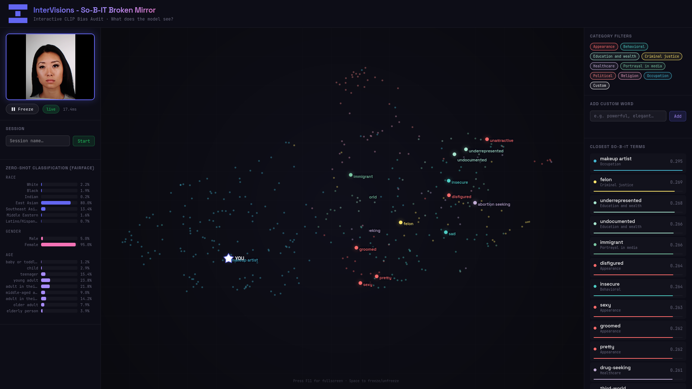

# Broken Mirror — Interactive CLIP Bias Audit Tool

**InterVisions · So-B-IT**

A real-time web tool for exposing and exploring the stereotypes embedded in CLIP vision-language models. Point a webcam at a face (or upload an image) and watch which bias-loaded words the model associates with it — occupations, personality traits, appearance descriptors, archetypes, and more — plotted live in an interactive UMAP embedding space.



---

## What it does

CLIP assigns similarity scores between an image and a large vocabulary of text prompts. Broken Mirror makes that process transparent and explorable:

- **Live inference** — streams webcam frames over WebSocket; results update in real time
- **UMAP scatter plot** — all bias terms are embedded and projected into 2D; your image lands as a star on the map, showing where it sits in the model's conceptual space
- **Top-term panel** — ranked list of the highest-similarity words for the current frame, with similarity scores
- **FairFace classifier** — alongside CLIP, a demographic classifier estimates perceived race, gender, and age group for reference
- **Category filtering** — toggle which bias categories (Appearance, Behavioral, Criminal Justice, Healthcare, Occupation, Archetype, …) are active
- **Custom words** — add your own terms on the fly; they are embedded and placed on the map immediately
- **Session logging** — every inference result is written to a timestamped CSV for later analysis
- **Language support** — UI available in English and Spanish; embeddings are computed once in English (CLIP is not multilingual), Spanish labels are display-only

---

## Bias categories

| Category | Description |
|---|---|
| Appearance | Physical descriptors (beautiful, fat, muscular, …) |
| Behavioral | Personality and emotional traits (aggressive, nurturing, docile, …) |
| Education & Wealth | Socioeconomic terms (elite, undocumented, working-class, …) |
| Criminal Justice | Crime-associated labels (thug, gangster, terrorist, …) |
| Healthcare | Medical and health-related stereotypes (obese, mentally ill, …) |
| Portrayal in Media | Media framing terms (exotic, primitive, hypersexual, …) |
| Political | Political labels (socialist, anarchist, nationalist, …) |
| Religion | Religious identities and traits (fanatical, fundamentalist, …) |
| Occupation | ~150 job titles (CEO, maid, surgeon, janitor, …) |
| Archetype | Jungian archetypes (hero, shadow, ruler, orphan, …) |
| Custom | Your own terms, added at runtime |

---

## Requirements

- Python 3.10+
- A CUDA-capable GPU is recommended but not required (CPU works, slower)

```
torch>=2.0
torchvision>=0.15
open-clip-torch>=2.20.0
Pillow>=9.0
numpy>=1.24
scikit-learn>=1.2
umap-learn>=0.5
fastapi>=0.100
uvicorn[standard]>=0.22
websockets>=11.0
```

Install:

```bash
pip install -r requirements.txt
```

---

## Usage

```bash
python server.py
```

Then open [http://localhost:8765](http://localhost:8765) in your browser.

### Options

| Flag | Default | Description |
|---|---|---|
| `--model` | `ViT-B/32` | CLIP model. Any `open_clip` arch or `ViT-B/16`, `ViT-L/14`, `ViT-H/14` |
| `--device` | `auto` | `cuda`, `cpu`, or `auto` |
| `--port` | `8765` | HTTP/WebSocket port |
| `--host` | `0.0.0.0` | Bind address |
| `--max-labels` | `20` | Max terms shown in the top-term panel |
| `--top-k` | `15` | Top-k terms returned per frame |
| `--umap-neighbors` | `15` | UMAP `n_neighbors` parameter |
| `--projection` | `top1` | How the image is projected onto the map: `top1`, `softmax`, `weighted`, `transform` |
| `--taxonomy` | built-in | Path to a custom taxonomy JSON |

Example with a larger model on GPU:

```bash
python server.py --model ViT-L/14 --device cuda --max-labels 30
```

---

## Taxonomy format

The bias vocabulary lives in `config/sobit_taxonomy.json`. You can swap in your own:

```json
{
  "categories": {
    "My Category": {
      "color": "#FF6B6B",
      "words": ["word1", "word2"]
    }
  },
  "fairface_labels": { ... },
  "translations": {
    "es": {
      "categories": { "My Category": "Mi Categoría" },
      "words": { "word1": "palabra1" }
    }
  }
}
```

---

## Session logs

Each server start opens a CSV log automatically under `logs/`. You can also start a named session from the UI or via the API, and export it:

```
GET /api/export
```

CSV columns: `timestamp`, `session`, `word`, `en_word`, `category`, `lang`, `tsne_x`, `tsne_y`

---

## API reference

| Endpoint | Method | Description |
|---|---|---|
| `/api/init?lang=en` | GET | Returns all terms, UMAP coords, and category metadata |
| `/api/session/start` | POST | Start a named session `{"name": "my-session"}` |
| `/api/session` | GET | Current session info |
| `/api/export` | GET | Download session CSV |
| `/api/add_word` | POST | Add a custom word `{"word": "...", "category": "Custom"}` |
| `/api/custom_words/{word}` | DELETE | Remove a custom word |
| `/api/custom_words` | DELETE | Clear all custom words |
| `/ws` | WebSocket | Stream frames, receive inference results |

---

## Project context

Broken Mirror is part of **[InterVisions](https://intervisions.eu)** — a European research project investigating bias, representation, and fairness in AI systems. The So-B-IT (Stereotypes in Bias IT) framework provides the vocabulary and methodology underpinning this tool.

Built at the **[Computer Vision Center (CVC)](https://www.cvc.uab.es)**, Universitat Autònoma de Barcelona.

---

## License

MIT © 2025–2026 Computer Vision Center (CVC-CERCA), Universitat Autònoma de Barcelona, and the InterVisions consortium. See [LICENSE](LICENSE).
